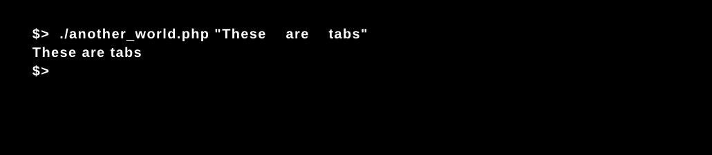
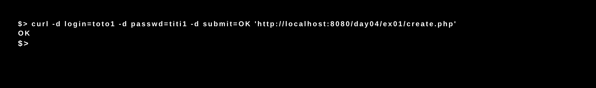

# Php_Piscine - Web Boot Camp at 42 School 

## Summary

### Day 00
HTML and CSS

This day was about learning how to create elements in HTML and give style with CSS to fictional web pages with re-directional links, tables, images, shrink responsiveness and drop down menus.  

### Day 01
PHP

From writing the classic "hello world", in this day we started to getting familiar with the PHP syntax by coding some programs to manipulate integers and strings. 

### Day 02
PHP

A funny mystery story led us through various exercises to discover a little bit more about php's libraries and helpfull functions to access local and external data.

### Day 03
PHP - MAMP

After installing our web server with the 42 PAMP tool, or starting the development server (localhost), we wrote php codes to recover users and passwords, save and delete cookies, read and display images in the browser window and validate member access to web pages.

### Day 04
PHP - MAMP

In this day we created different pages to manage a user session. The exercises were about creating an account, login (authorization via a self-build function), changing the password, and be able to save in a file the users data to create a basic multi-user chat page.

### Day 05
SQL

Is the start of the second week and now we were writing more than twenty different commands to work with databases using SQL language. The exercises covered creation of databases and tables, inserting, updating, and selection of data. By combining some functions we were able to display specific and requiered information from a films database.

### Day 06
PHP - OOP

This day we learned about how to implement object-oriented programming (OOP) in PHP. The excercises guided us to create a small program to display 3D graphics. Each class covered one graphic aspect: color, dots, lines, matrixes, camera and texture. We learned about attributes and methods (static, dynamic, public and private), instances and proper class documentation.

### Day 07
PHP - OOP

A day dedicated to Game of Thrones, allowed us to better understand the logic of object-oriented programming, particularly inheritance (parent and child classes), abstract classes, abstract methods and interfaces, in a really fun way.

### Day 08
Awesome Starships Battles I

This day we covered the utilisation of traits (inheritance but in an horizontal point of view), final classes, exceptions (handling errors), reflection classes and reflection objects (recover and manipulate the data inside). The exercise goal was to create a game called "Awesome Starships Battles", a 2 players game which goal is to control a fleet of spaceships and eliminate the adversary fleet first. The composition of this game was very convenient to put togheter PHP-OOP, HTML and CSS.

### Day 09
JavaScript and JQuery

The las day of the piscine was dedicated to learn the syntax and functions of JavaScript, and throught DOM (Document Object Modeling) we created interactive web pages setting mouse and keyboard events to affect the appearence of HTML elements. Finally we get involved with the JQuery library and AJAX to update parts of a web page without reloading the whole page (asynchronous execution).

<kbd></kbd>

### Rush 00
E-commerce

After the first week of the piscine, we had to -in a weekend– create a mini e-commerce online shop. This should cover products and users management with a well organized data base. Our e-commerce should allow a user to register, connect, add articles in his basket and validate his order. Once validated, the order must be visible from an administration section.

### Rush 01
Awesome Starships Battles II

This is an ambitious project that aims to gather all the tools learned during this boot-camp. This second rush was about remasterizing the game created at day 08, and adding account management, users ranking, chat panel, simultaneously games, scripted games and other cool features alike. 

## Credits
[*Luis Julian Sanchez Quiros*](https://www.linkedin.com/in/luis-juli%C3%A1n-s%C3%A1nchez-quir%C3%B3s-13bb3b189/)
2019. Freemont, CA

## About 42 School
[42][42] is a free, non profit, project-based, peer-to-peer learning coding school. It originated in France and now has over 20 campuses all over the world. More information can be found [here][42]

[42]: http://42.us.org "42 USA"
[pdf]:  "Pdf"
