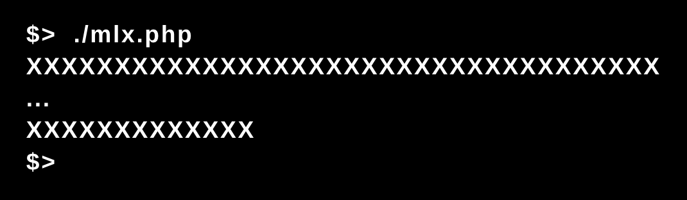
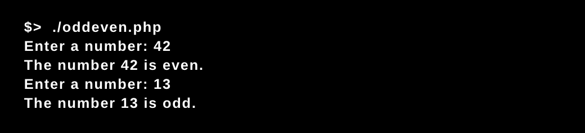
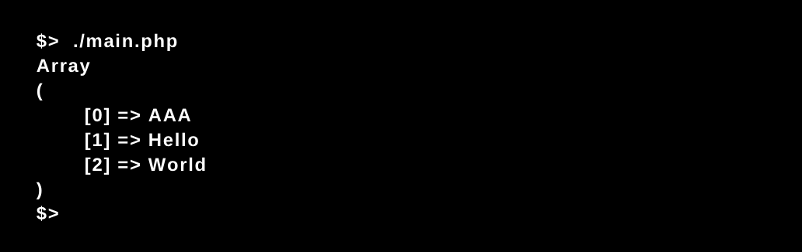
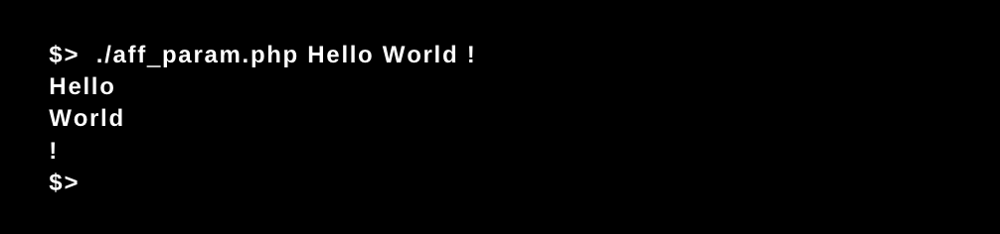
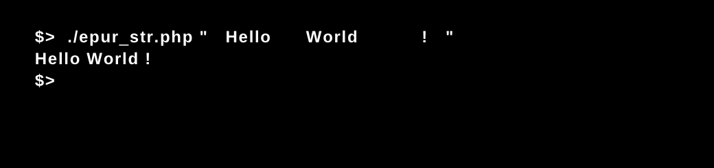
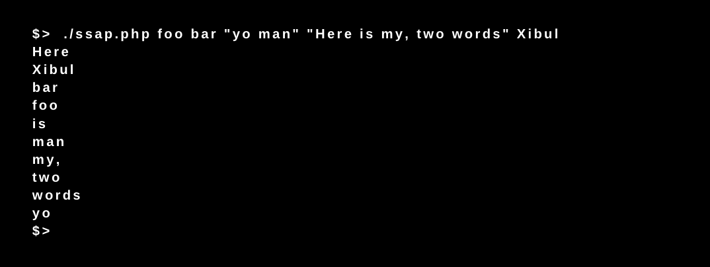
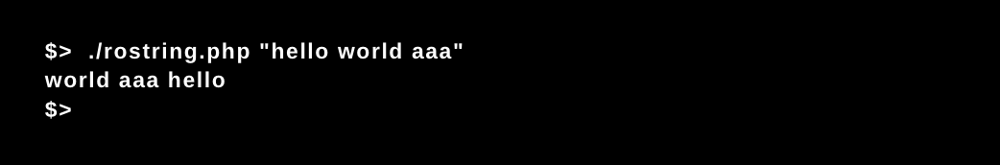
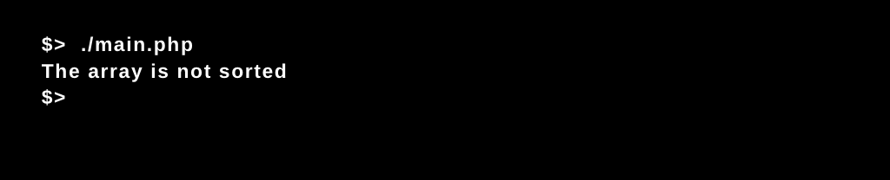

# Php_Piscine / day01

### PHP

From writing the classic "hello world", in this day we started to getting familiar with the PHP syntax by coding some programs to manipulate integers and strings. 

