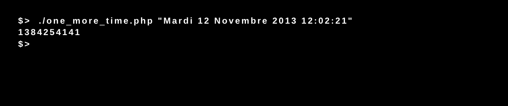

# Piscine_Php / day02 / ex01

## Description
This program takes a well formatted date and convert in time stamp. The unix time stamp is a way to track time as a running total of seconds. This count starts at the Unix Epoch on January 1st, 1970 at UTC. Therefore, the unix time stamp is merely the number of seconds between a particular date and the Unix Epoch.

## Installation
`chmod 755 one_more_time.php` | Set permissions for execution.

## Usage
`./one_more_time.php [argument date]` | executes the program.
