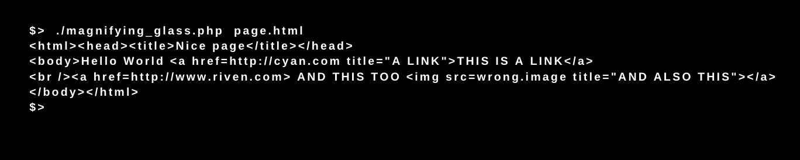

# Piscine_Php / day02 / ex02 : The magnifying glass

## Description
This program takes a html document as argument and convert all the links to upper case.

## Installation
`chmod 755 magnifying_glass.php` | Set permissions for execution.

## Usage
`./magnifying_glass.php [argument html file]` | executes the program.

## Preview

