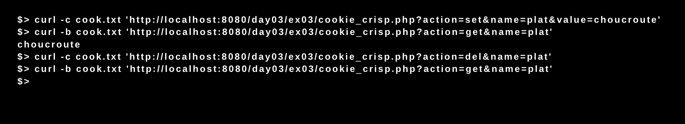
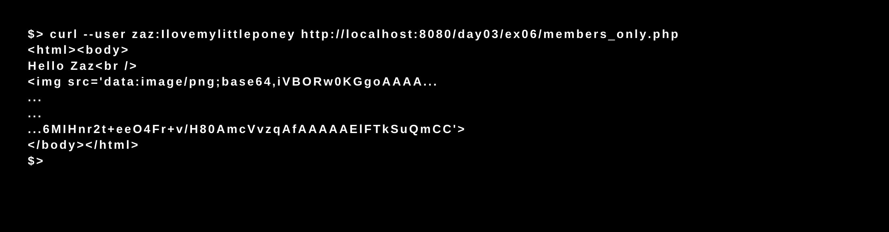

# Day 03 - Piscine_Php

### PHP - MAMP

After installing our web server with the 42 PAMP tool (or localhost) we wrote php codes capable of recovering users and passwords, saving and deleting cookies, displaying images in the browser window and validating member access to fictional web pages.
