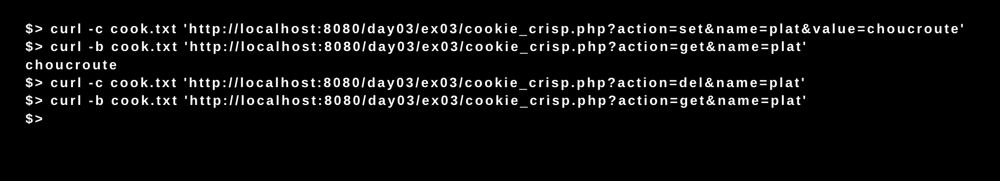

# Piscine_Php / day03 / ex03 : cookie_crisp

## Description
The objective of this exercise was to create a page named cookie_crisp.php that will allow to create, read and erase a cookie.

## Installation
`php -S localhost:8080` | start the development server.

## Usage
`curl -c [cookie file path] 'http://localhost:8080/day03/ex03/cookie_crisp.php?action=set&name=[cookie name]&value=[cookie value]'` | Creates a cookie in the specified file.

`curl -b [cookie file path] 'http://localhost:8080/day03/ex03/cookie_crisp.php?action=get&name=[cookie name]'` | Display the cookie value.

`curl -c [cookie file path] 'http://localhost:8080/day03/ex03/cookie_crisp.php?action=del&name=[cookie name]'` | Erase the cookie.

## Preview

