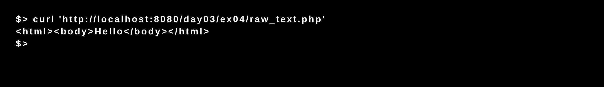

# Piscine_Php / day03 / ex04 : raw_text

## Description
The objective of this exercise was to create a page named raw_text that will show the same thing on the screen if you look at its source code with curl or its html rendered in Chrome.

## Installation
`php -S localhost:8080` | start the development server.

## Usage
`curl 'http://localhost:8080/day03/ex04/raw_text.php'` | Executes the program.

## Preview

