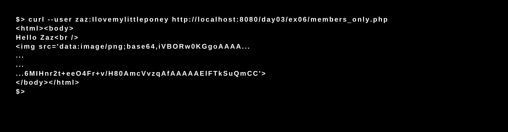
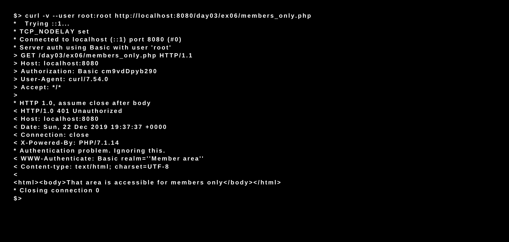

# Piscine_Php / day03 / ex06 : members_only

## Description
The objective of this exercise was to create a page named members_only.php that will require a login/password at the http protocol level. If the login is “zaz” and the password “Ilovemylittleponey” the answer must be an html page that contains an img tag whose source is directly the image “/img/42.png” but not its url.

## Installation
`php -S localhost:8080` | start the development server.

## Usage
`curl --user zaz:jaimelespetitsponeys http://localhost:8080/day03/ex06/members_only.php` | Executes the program.

`curl -v --user root:root http://localhost:8080/day03/ex06/members_only.php` | Error test case.

## Preview

