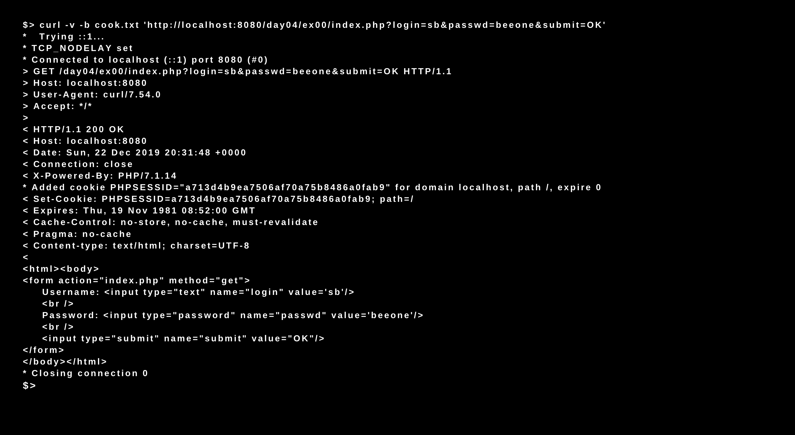

# Day 04 - Php_Piscine

### PHP - MAMP

In this day we created different pages to manage a user session. The exercises were about creating an account, login (authorization via a self-build function), changing the password, and be able to save in a file the users data to create a basic multi-user chat page.

