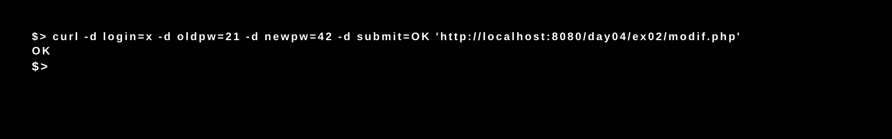

# Php_Piscine / day04 / 02 : Modif account

## Description
The objective of this exercise was to create a page named index.html that will contain a form allowing to modify the password associated to an account. The user will need to submit its username, its current password and its new password.

## Installation
`php -S localhost:8080` | start the development server.

## Usage
`curl -d login=x -d oldpw=21 -d newpw=42 -d submit=OK 'http://localhost:8080/day04/ex02/modif.php'` | Executes the program.

## Preview

