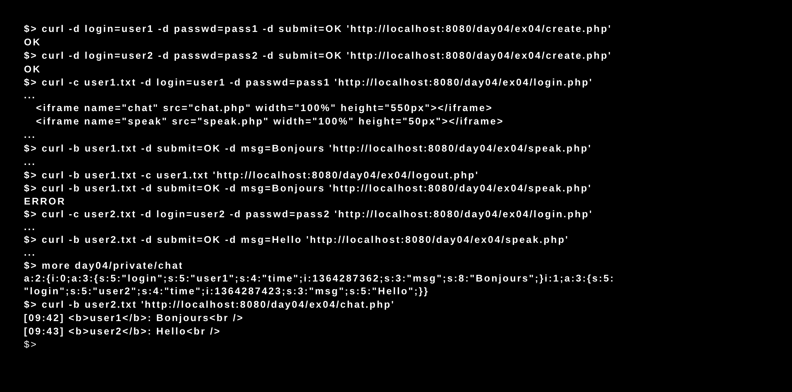

# Piscine_Php / day04 / 04 : 42chat

## Description
The goal of this exercise was to create a multi-user chat, by resuming from our files of prior exercises and add number new ones: index.html, create.html, modif.html, speak.php and chat.php. Speak.php will allow a user to post a message on the chat, and chat.php will allow to display the content of this chat.

## Installation
`php -S localhost:8080` | start the development server.

## Usage
`curl -c [user cookie file path] -d login=[name] -d passwd=[password] 'http://localhost:8080/day04/ex04/login.php'` | Executes login.php and open the chat window.

`curl -b [user cookie file path] -d submit=OK -d msg=[message] 'http://localhost:8080/day04/ex04/speak.php'` | Executes speak.php and save the message in the cookie file.

`curl -b [user cookie file path] 'http://localhost:8080/day04/ex04/chat.php'` | Executes chat.php and display the messages contained in the cookie file.

## Preview

