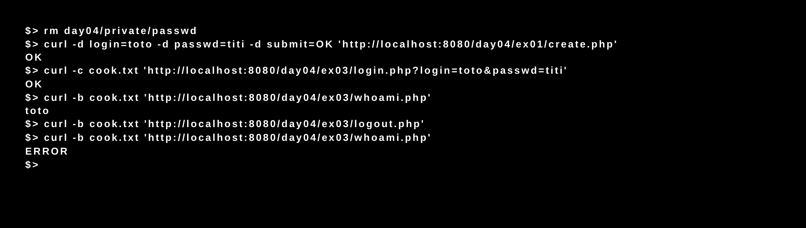

# Piscine_Php / day04 / 03 : Auth

## Description
The objective of this exercise was to create four files: 
- login.php: this page will start the session, check the validity of the combo login/passwd 
and store in the session a variable “loggued_on_user”.
- auth.php: is the function that helps login.php to validate the login/passwd combo.
- whoami.php: will use the session cookie to display the login contained in ‘loggued_on_user”.
- logout.php: will remove the session cookie to finish the user's session.

## Installation
`php -S localhost:8080` | start the development server.

## Usage
`curl -c [cookie file path] 'http://localhost:8080/day04/ex03/login.php?login=[login name]&passwd=[password]'` | Executes login.php.

`curl curl -b [cookie file path] 'http://localhost:8080/day04/ex03/whoami.php'` | Executes whoami.php.

`curl curl -b [cookie file path] 'http://localhost:8080/day04/ex03/logout.php'` | Executes logout.php.

## Preview

