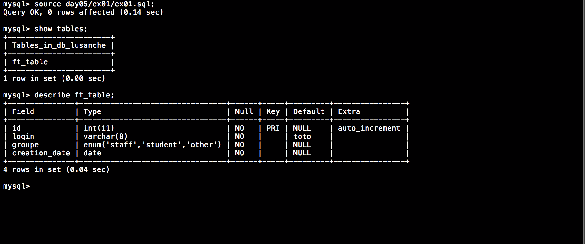

# Day 05 - Piscine_Php

### SQL

Is the start of the second week and now we were writing more than twenty different commands to work with databases using SQL language. The exercises covered creation of databases and tables, inserting, updating, and selection of data. By combining some functions we were able to display specific and requiered information from a films database.

