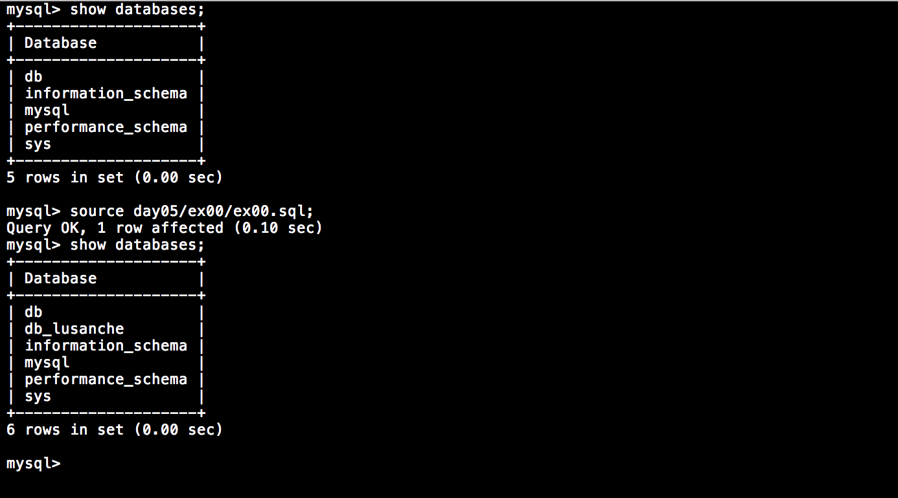

# Php_Piscine / day05 / ex00 : db_bocal

## Description
The objective was to write the SQL request needed to create a database named after our login preceded by ’db_’. This database will be used for the next exercises.

## Installation
`mysql` | connect to local MySQL server.

## Usage
`mysql> source day05/ex00/ex00.sql;` | executes the request.

## Preview

