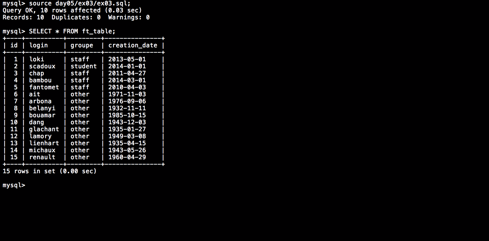

# Piscine_Php / day05 / ex03 : Copy!

## Description
Create the request to fill the table from ex01 using a second table’s data.

## Installation
`mysql db_lusanche < day05/base-student.sql > output.tab;` | add the given table to the database.

`mysql` | connect to local MySQL server.

## Usage
`mysql> source day05/ex03/ex03.sql;` | executes the request.

## Preview

