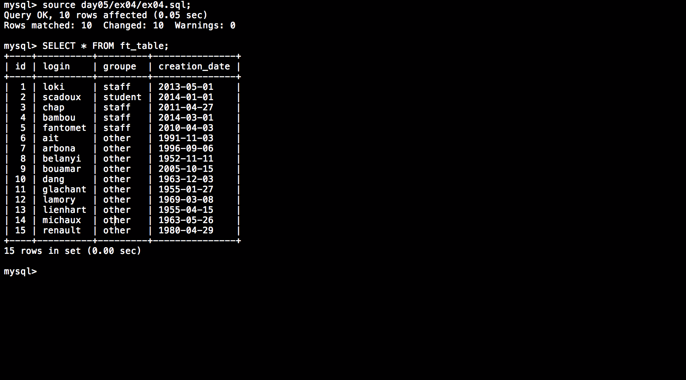

# Php_Piscine / day05 / ex04 : Updates pending, please restart

## Description
Create the request to update the user’s creation_date of ex04 table, by adding 20 years, but only for the users that have an id bigger than 5.

## Installation
`mysql` | connect to local MySQL server.

## Usage
`mysql> source day05/ex04/ex04.sql;` | executes the request.

## Preview

