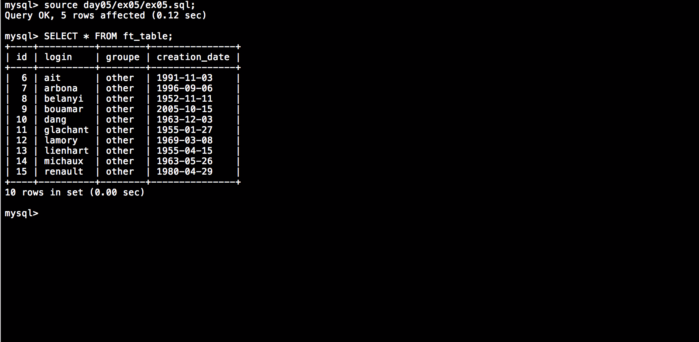

# Piscine_Php / day05 / ex05 : Little bit of cleaning

## Description
Create the request to remove the people manually created on ex02, in other words, the 5 first members of the ft_table.

## Installation
`mysql` | connect to local MySQL server.

## Usage
`mysql> source day05/ex05/ex05.sql;` | executes the request.

## Preview

