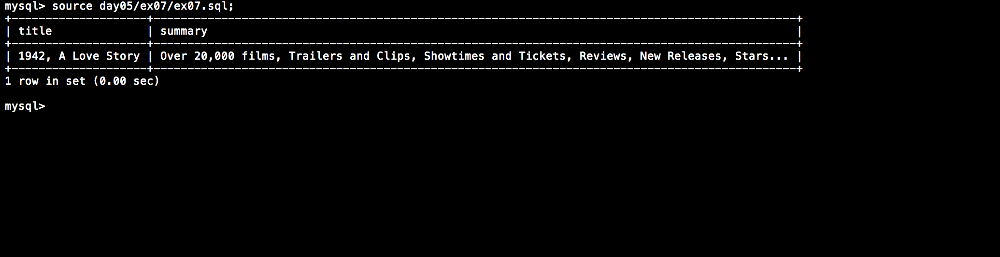

# Piscine_Php / day05 / ex07 : 42 is everywhere!

## Description
Create the request to display, from 'film' table, the title and summary of all movies containing 42 in their title or summary ordered from the shortest film to the longest.

## Installation
`mysql db_lusanche < day05/base-student.sql > output.tab;` | add 'film' table to our database.

`mysql` | connect to local MySQL server.

## Usage
`mysql> source day05/ex07/ex07.sql;` | executes the request.

## Preview

