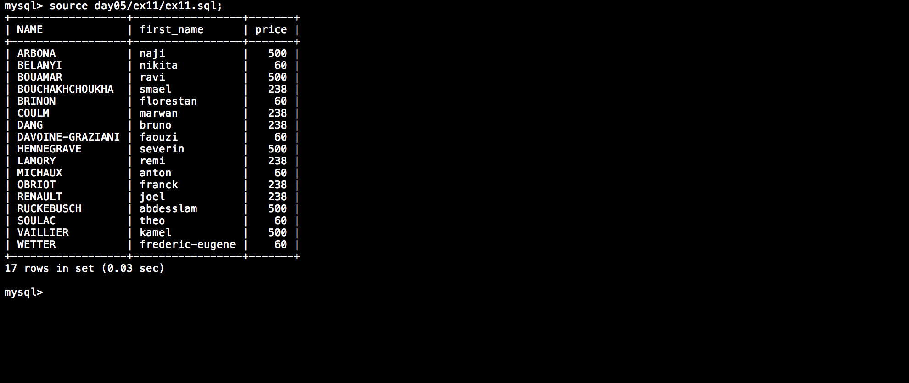

# Php_Piscine / day05 / ex11 : Money is essential

## Description
Create the request to display the last_name in uppercase in a ’NAME’ column, the first_name and the price of the users having a subscription higher than 42 euros. Order result by ascending last_name and by ascending first_name.

## Installation
`mysql db_lusanche < day05/base-student.sql > output.tab;` | add tables to database.

`mysql` | connect to local MySQL server.

## Usage
`mysql> source day05/ex11/ex11.sql;` | executes the request.

## Preview

