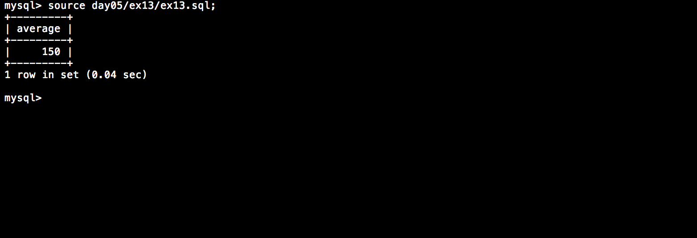

# Piscine_Php / day05 / ex13 : Are you good at maths?

## Description
Create the request to display in a column named ’average’ the average number (rounded up to the nearest unit) of seats in each cinema.

## Installation
`mysql db_lusanche < day05/base-student.sql > output.tab;` | add tables to database.

`mysql` | connect to local MySQL server.

## Usage
`mysql> source day05/ex13/ex13.sql;` | executes the request.

## Preview

