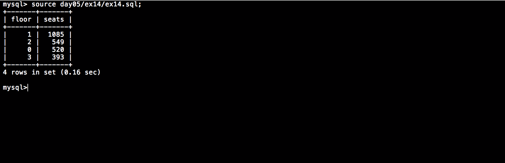

# Php_Piscine / day05 / ex14 : You, you will read again...

## Description
Create the request to display, for each floor, the floor_number in a ’floor’ column and nb_seats by floor in a ’seats’ column. Ordered by floor with the highest number of seats to the floor with the least number of seats.

## Installation
`mysql db_lusanche < day05/base-student.sql > output.tab;` | add tables to database.

`mysql` | connect to local MySQL server.

## Usage
`mysql> source day05/ex14/ex14.sql;` | executes the request.

## Preview

