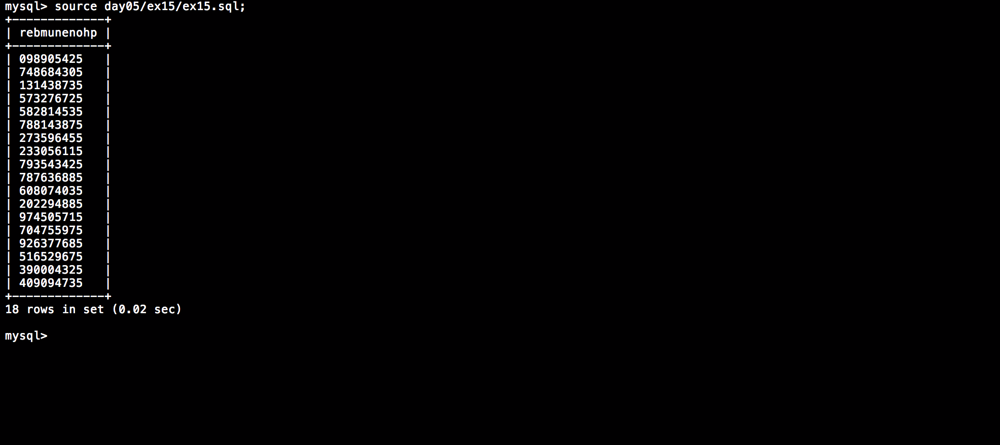

# Php_Piscine / day05 / ex15 : What’s your phone number?

## Description
Create the request to display all the distributors’ phone_number starting with ’05’ by removing the number 0 before the 5 and by reverting the numbers, in a column named ’rebmunenohp’ (ex : 0542842169 -> 961248245).

## Installation
`mysql db_lusanche < day05/base-student.sql > output.tab;` | add tables to database.

`mysql` | connect to local MySQL server.

## Usage
`mysql> source day05/ex15/ex15.sql;` | executes the request.

## Preview

