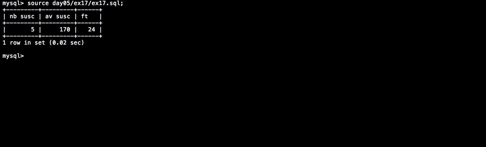

# Php_Piscine / day05 / ex17 : Maths - THE COME BACK

## Description
Create the request to display the number of offered subscription in a column named ’nb_susc’, as well as the average subscription price, rounded to the unit (below) in a column named ’av_susc’. There must be a third colum named ’ft’ displaying the sum of modulo 42 subscribtion lengths.

## Installation
`mysql db_lusanche < day05/base-student.sql > output.tab;` | add tables to database.

`mysql` | connect to local MySQL server.

## Usage
`mysql> source day05/ex17/ex17.sql;` | executes the request.

## Preview

