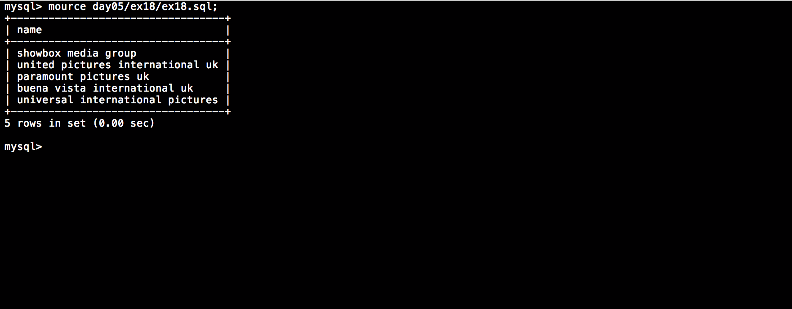

# Piscine_Php / day05 / ex18 : There are some limits!

## Description
Create the request to display the distributors who have the following id_distrib 42, 62, 63, 64, 65, 66, 67, 68, 69, 71, 88, 89 and 90 as well as distibutors with ’y’ or ’Y’ twice in their name. The final list will be a sample of 5 results starting at the third result.

## Installation
`mysql db_lusanche < day05/base-student.sql > output.tab;` | add 'distrib' table to our database.

`mysql` | connect to local MySQL server.

## Usage
`mysql> source day05/ex18/ex18.sql;` | executes the request.

## Preview

