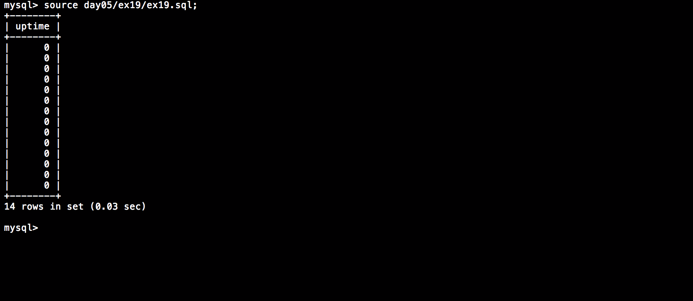

# Piscine_Php / day05 / ex19 : Back to the future

## Description
Create the request to display in an ’uptime’ column the number of absolute days separating the oldest viewing of a movie with the most recent.

## Installation
`mysql db_lusanche < day05/base-student.sql > output.tab;` | add tables to database.

`mysql` | connect to local MySQL server.

## Usage
`mysql> source day05/ex19/ex19.sql;` | executes the request.

## Preview

