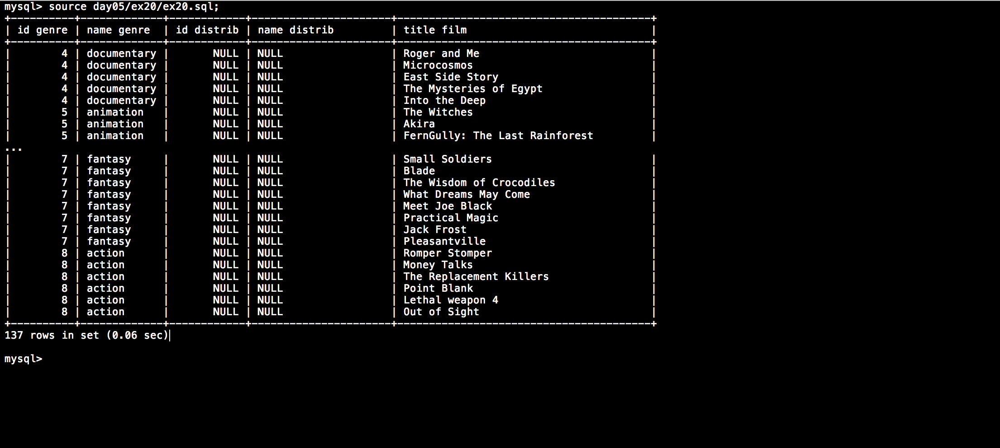

# Piscine_Php / day05 / ex20 : The total

## Description
Create the request to display all the movies with an id_genre between 4 and 8 included. The request will display the id_genre, the genre’s name, as well as the distributor’s id_distrib, the dis- tributor’s name as well as the film’s title. You’ll therefore need the following columns ’id_genre’, ’name_genre’, ’id_distrib’, ’name_distrib’ et ’title_film’. The request must display the id_genre, the distributor’s id_distrib, and the title even if you can’t find a genre’s name or a distributor’s name.

## Installation
`mysql db_lusanche < day05/base-student.sql > output.tab;` | add tables to database.

`mysql` | connect to local MySQL server.

## Usage
`mysql> source day05/ex20/ex20.sql;` | executes the request.

## Preview

