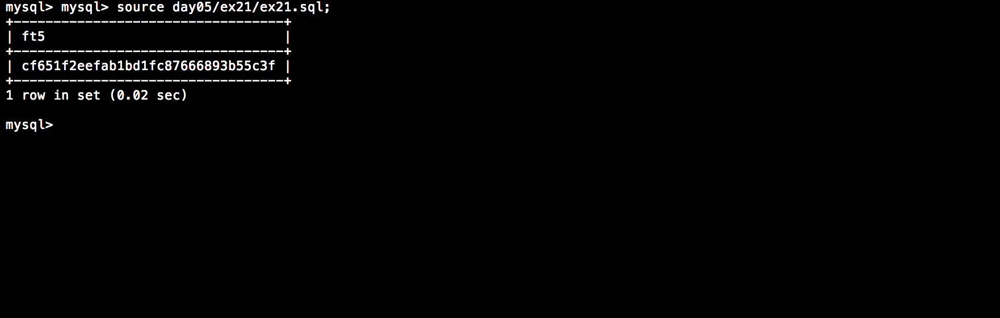

# Piscine_Php / day05 / ex21 : MD5 ? Not FT5!

## Description
Create the request to display, in a column named ’ft5’, the phone_number’s MD5 of the distributor with id 84. Before encripting it you’ll add 42 at the end of it and change any 7 into a 9.

## Installation
`mysql db_lusanche < day05/base-student.sql > output.tab;` | add tables to database.

`mysql` | connect to local MySQL server.

## Usage
`mysql> source day05/ex21/ex21.sql;` | executes the request.

## Preview

