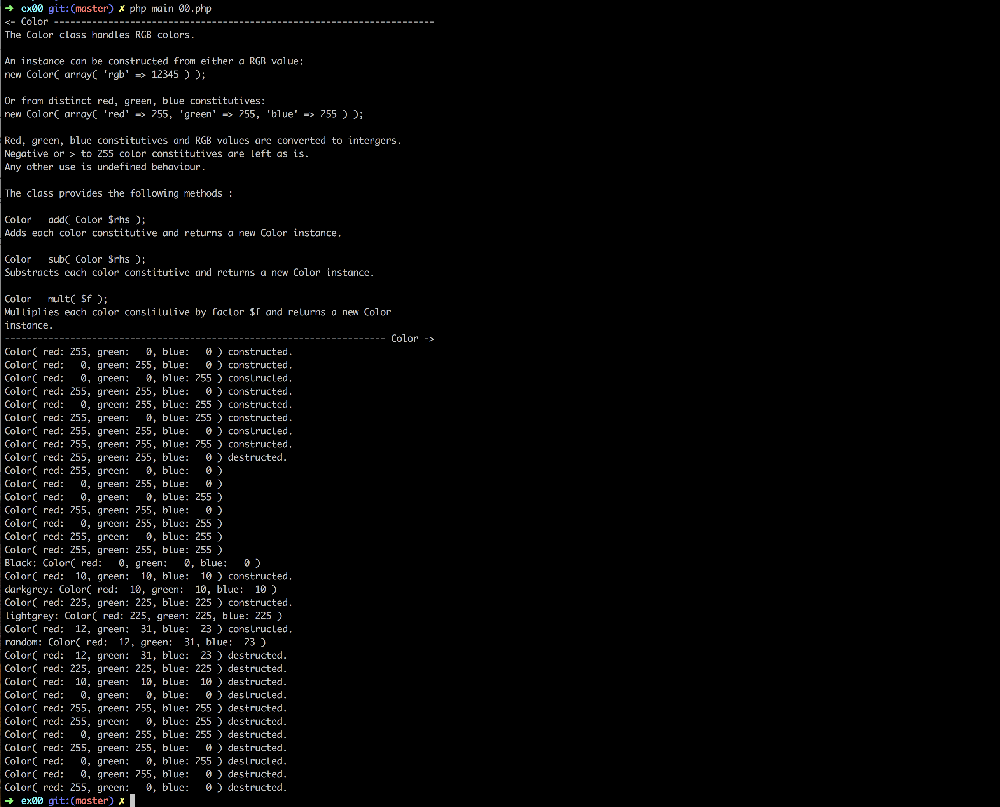
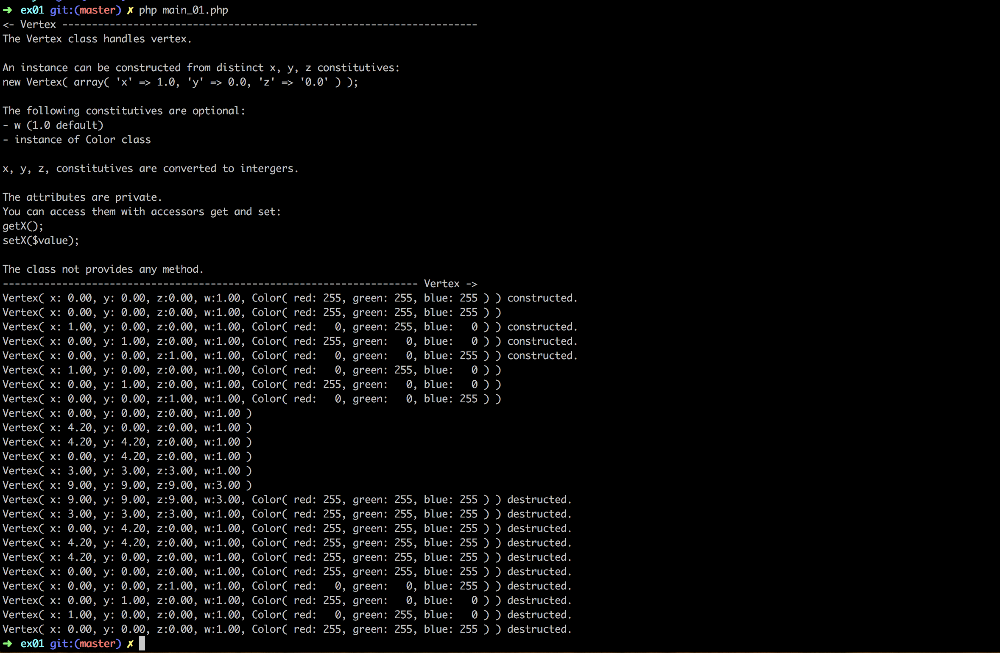
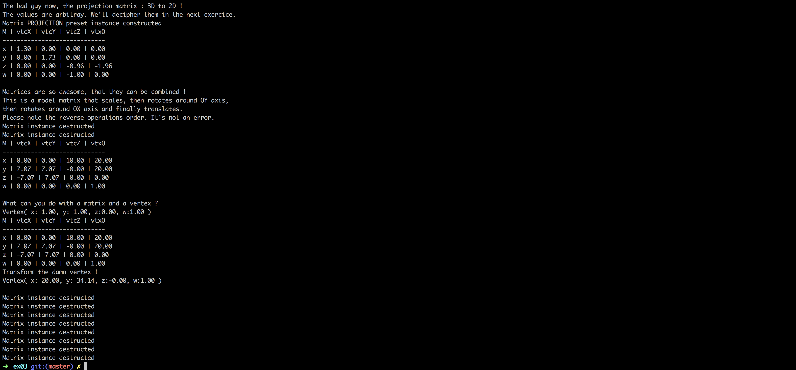

# Piscine_Php / day06

### PHP - OOP

This day we learned about how to implement object-oriented programming (OOP) in PHP. The excercises guided us to create a small program to display 3D graphics. Each class covered one graphic aspect: color, dots, lines, matrixes, camera and texture. We learned about attributes and methods (static, dynamic, public and private), instances and proper class documentation.

