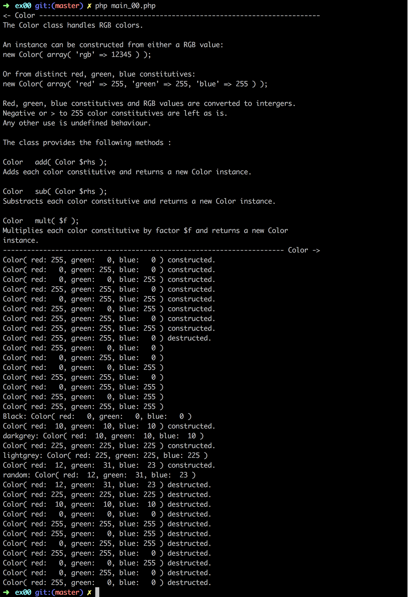

# Php_Piscine / day06 / ex00 : The Color Class

## Description
This Color Class will allow us to represent colors and perform a few simple operations on their components.
The Color class handles RGB colors. An instance can be constructed from either a RGB value or from distinct red, green, blue constitutives. The class provides the following methods: Color add, Color sub and Color mult.

## Usage
`php -f main_00.php` | executes the program.

## Preview

