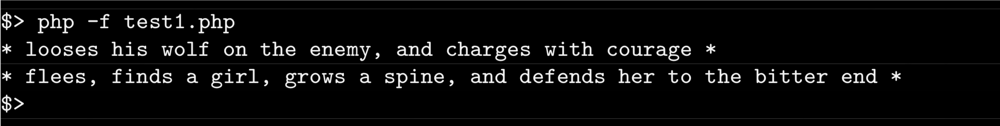

# Piscine_Php / day07 / ex05 : Winter is coming

## Description
For this one, we create two classes, the first is named NightsWatch, and the second is actually an interface named IFighter. The NightsWatch have two public methods, one for adding attributes to an array and the other to run a method in the child classes. The array will be fulled only by attributes instanciated by classes that are implementing the interface IFighter. The result is an array full with 'fighters', and then we can display their actions in the battle.

## Usage
`php -f test1.php` | executes the program.
