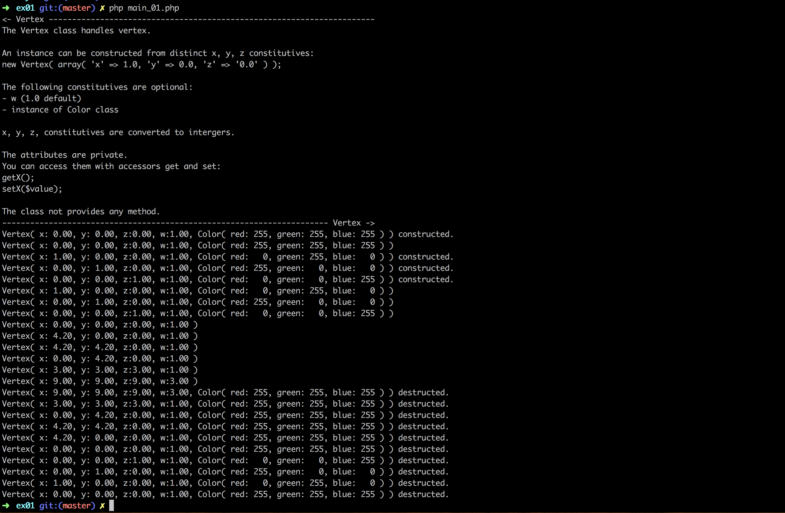

# Php_Piscine / day06 / ex01 : The Vertex Class

## Description
This class will now look at the representation of a point in space: the "vertex".
An instance can be constructed from distinct x, y, z constitutives, the attributes are private and the class not provides any method.

## Usage
`php -f main_01.php` | executes the program.

## Preview

