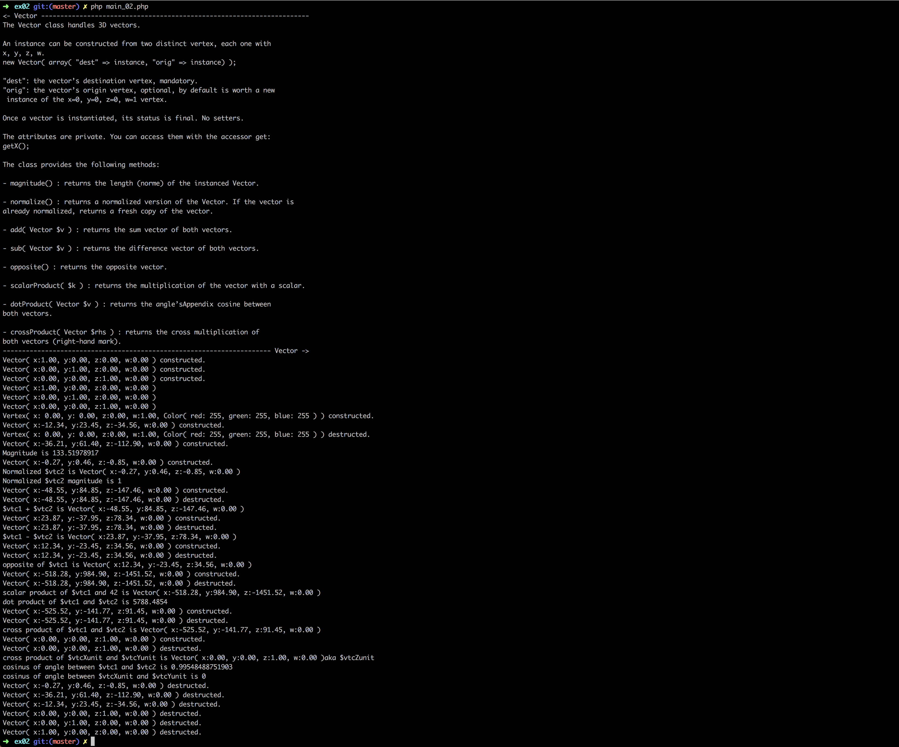

# Php_Piscine / day06 / ex02 : The Vector Class

## Description
The vector class allow us to represent directions or movements of points, in other word: lines.
An instance can be constructed from two distinct vertex, where "dest" is the vector’s destination vertex, and "orig" the vector’s origin vertex. This class provides the following methods: magnitude, normalize, add, sub, opposite, scalarProduct, dotProduct and crossProduct.

## Usage
`php -f main_02.php` | executes the program.

## Preview

