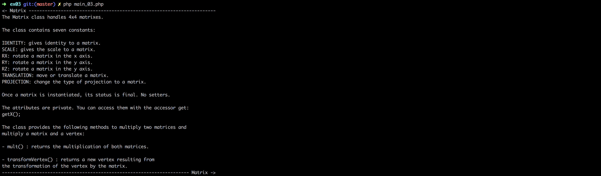

# Php_Piscine / day06 / ex03 : The Matrix Class

## Description
With this class, we will be able to operate transformations, such as apply a scale change, a translation or a rotation to one or several vertices.

The Matrix class handles 4x4 matrixes and contains seven constants: IDENTITY, SCALE, RX, RY, RZ, TRANSLATION and PROJECTION.
The class provides the following methods to multiply two matrices and
multiply a matrix and a vertex: mult and transformVertex.

## Usage
`php -f main_03.php` | executes the program.

## Preview

