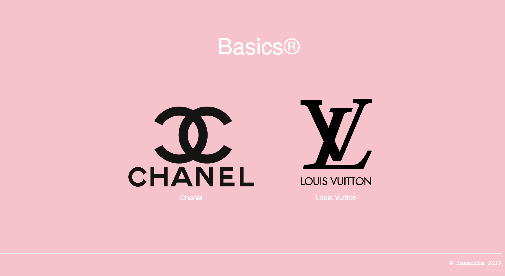

# Day 07 - Piscine_Php

### PHP - OOP

A day dedicated to Game of Thrones, allowed us to better understand the logic of object-oriented programming, particularly inheritance (parent and child classes), abstract classes, abstract methods and interfaces, in a really fun way.
