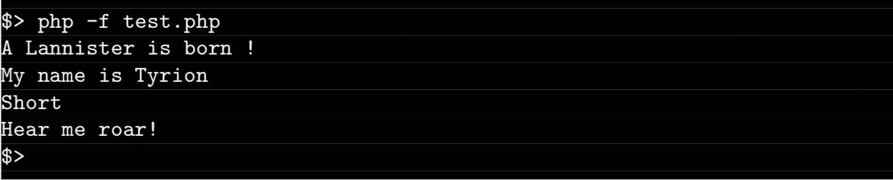

# Php_Piscine / day07 / ex00 : Short and proud

## Description
This exercise whas about creating a class named Tyrion, which inheritates from the provided class named Lannister and contains a method to get the size of the class.

## Usage
`php -f test.php` | executes the program.

## Preview

