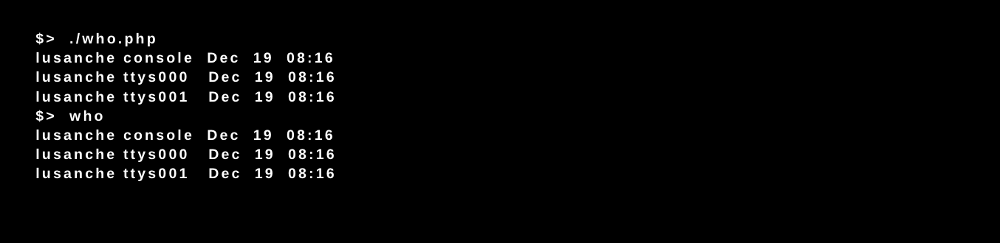

# Piscine_Php / day02 / ex03

## Description
This program reproduce the behavior of the standard Unix command 'who', displaying a list of users who are currently logged into the computer by accesing to the utmp file that keep track of all logins and logouts to the system and printing the info retrieved in a determined format.

## Installation
`chmod 755 who.php` | Set permissions for execution.

## Usage
`./who.php` | executes the program.
