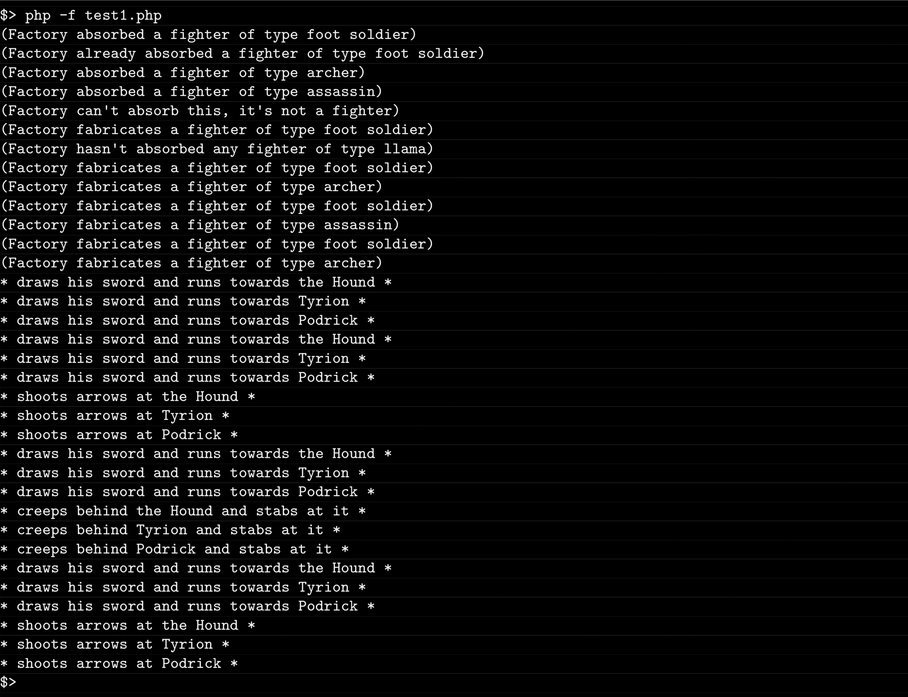

# Piscine_Php / day07 / ex06 : The wrong kind of pact

## Description
This exercise required to create two classes, so we can display the battle actions taken in place between two specific characters of Game of Thrones. The UnholyFactory class, by one of his methods, will store in an array the attributes instanciated by all the child classes that extends from the Fighter parent class. Then a second method in the UnholyFactory class will display all the elements contained in the array of 'fighters'. The action between certain characters will be executed by the test file script and the methods defined on the child classes.

## Usage
`php -f test1.php` | executes the program.

## Preview

