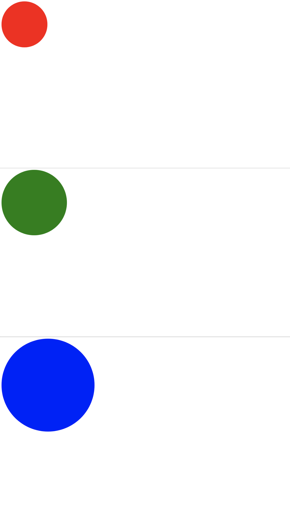
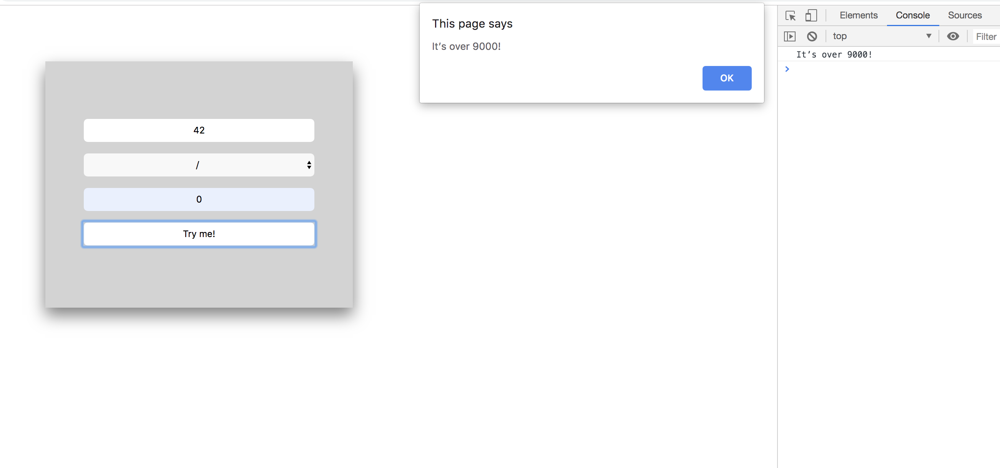
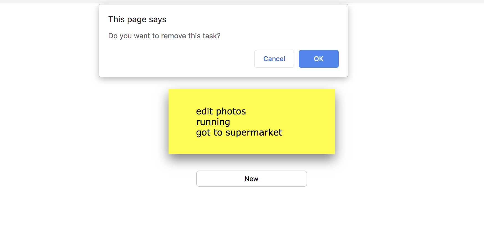

# Day 09 - Piscine_Php

JavaScript and JQuery

The last day of the Php piscine was dedicated to learn the syntax and functions of JavaScript, and throught DOM (Document Object Modeling) we created interactive web pages setting mouse and keyboard events to affect the appearence of HTML elements. Finally we get involved with the JQuery library and AJAX to update parts of a web page without reloading the whole page (asynchronous execution).

<kbd></kbd>

