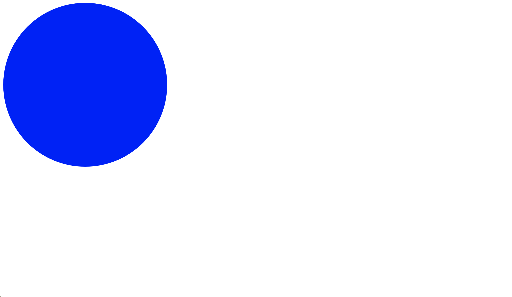

# Piscine_Php / day00 / ex00 : Basics or home

## Description
The gol for this exercise was to blow a balloon. 
Create in HTML/CSS a div 200px by 200px with a red background color. The bor- ders will be rounded to create a perfect round shape and not a square anymore. That div will then be our balloon. When a click occurs on the balloon, its size will grow by 10px while keeping its round shape. With each click its color will go in that order from red to green, then blue and back to red again. Usually, this type of balloon is rather resistant but if its size becomes greater than 420px it will explode and return to its original size. Small additional detail, when the mouse is in the balloon and leaves it, the size of the balloon shrinks by 5px (the size of the balloon cannot go lower than 200px) and its color changes in the reverse order than mentioned earlier.

## Installation
`open ballon.html` | Open the page in the web browser.

## Usage
`click on the red circle` | The circle increases its size and change color (red-green-blue-red).

`mouse leaves the circle` | The circle decreases its size and change color in reverse order (red-blue-green-red).

## Preview

