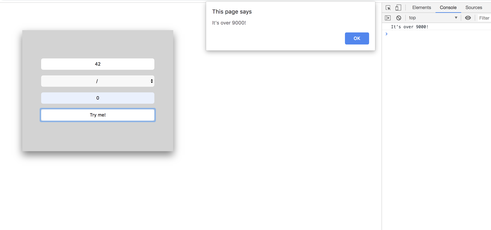

# Piscine_Php / day09 / ex01 : It’s over 9000

## Description
The gol for this exercise was to create a basic calculator. The result also needs to be displayed on the console of the browser. Both inputs fields can only contain positive integer values and division and modulo by zero display an alert message. Every 30 seconds, an alert pop-up window will appear saying ’Please, use me...’.

## Installation
`open calc.html` | Open the page in the web browser.

## Usage
`enter the values and click on 'Try Me!'` | Perform the calculation.

## Preview

<kbd></kbd>
