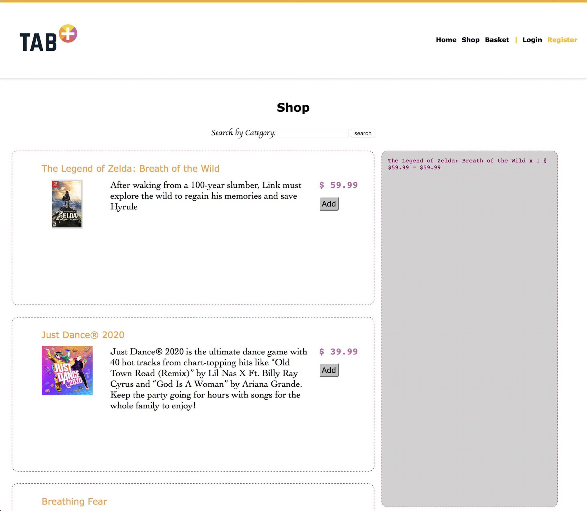

# Rush 00 - Piscine_Php

### E-commerce

After the first week of the piscine, we had to -in a weekend– create a mini e-commerce online shop. This should cover products and users management with a well organized data base. Our e-commerce should allow a user to register, connect, add articles in his basket and validate his order. Once validated, the order must be visible from an administration section.

## Installation
`php -S localhost:8080` | Start the development server.

`open http://localhost:8080/rush00/index.php` | Open the page in the web browser.

## Usage
`'Register'` | Creates new user and password.

`'Login'` | Start user session.

`Shop` | Add items to the 'basket'.

`MyAccount` | Change password.

## Preview

<kbd></kbd>
<kbd></kbd>
