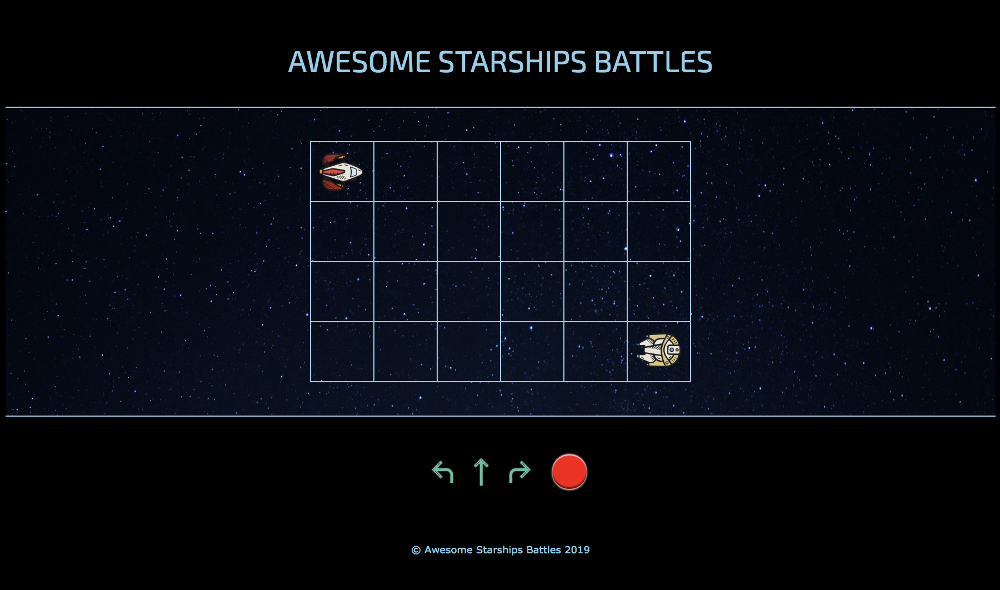

# Rush 00 - Piscine_Php

### E-commerce

After the first week of the piscine, we had to -in a weekend– create a mini e-commerce online shop. This should cover products and users management with a well organized data base. Our e-commerce should allow a user to register, connect, add articles in his basket and validate his order. Once validated, the order must be visible from an administration section.

## Installation
`open game.html` | Open the page in the web browser.

## Preview

